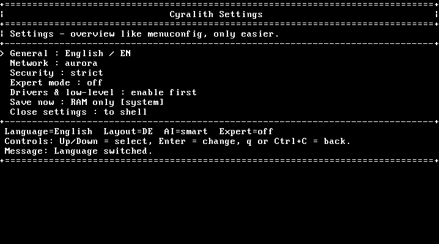

# CyralithOS

CyralithOS is a completely new operating system that is not based on Linux, Windows, or any other existing operating system.

Its goal is to combine the simplicity of Windows with the modularity of Linux, while also being one of the first operating systems to integrate AI directly into its shell.

CyralithOS is not based on DOS or UNIX. Instead, it uses **AuroraFS**, a custom filesystem with UNIX-like structures.

At the moment, CyralithOS supports **German** and **English** only.

CyralithOS currently has **no graphical user interface** and is based entirely on a **CLI**.

## Project status

CyralithOS is still in a very early stage of development.  
Full functionality, stability, and compatibility are **not guaranteed**.

Bug reports, suggestions, and feedback are very welcome.

## Usage and disclaimer

CyralithOS is publicly visible on GitHub for reference and collaboration discussion.

No license has been granted at this time.  
Please do not copy, redistribute, or modify this project without permission.

This project is provided **as is**, without warranty of any kind.  
Obsidian is not responsible for any damage, data loss, or other issues that may arise from using CyralithOS.

## Author

Programmiert von Obsidian.

