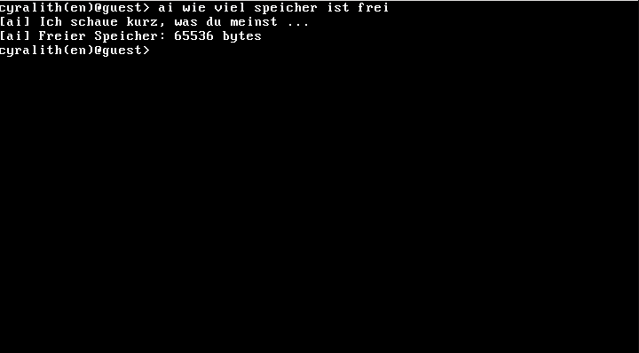
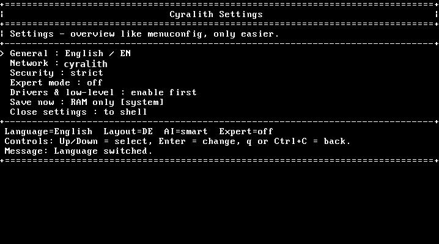
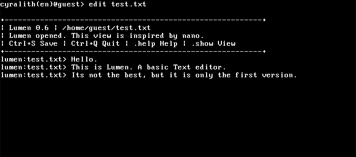

# Cyralith

> This ZIP variant ships with **IRQ safe mode enabled**: hardware IRQs stay masked and `sti` remains disabled so the system can boot and be used with keyboard polling while low-level interrupt issues are debugged.

Cyralith is a completely new operating system that is not based on Linux, Windows, or any other existing operating system.

Its goal is to combine the simplicity of Windows with the modularity of Linux, while also being one of the first operating systems to integrate AI directly into its shell.

Cyralith is not based on DOS or UNIX. Instead, it uses **CyralithFS**, a custom filesystem with UNIX-like structures.

At the moment, Cyralith supports **German**, **English**, and **Indonesian**.

Cyralith currently has **no graphical user interface** and is based entirely on a **CLI**.

## Current implemented highlights

- CLI-first shell with German, English, and Indonesian support
- CyralithFS RAM filesystem with permissions and persistence hooks
- Cooperative service scheduler with runtime metrics
- Paging foundation with active x86 page directory, frame allocator, and page-fault tracking
- Cooperative process model with PIDs, states, managed regions, and shell controls
- Custom commands and manifest-based external programs with approvals and capabilities
- Basic package/module layer via `app`, `prog`, and `pkg`
- Network basis with NIC detection, `netup`, `netprobe`, and diagnostics
- Local rule-based AI routing with simple natural-language command execution
- Task automation via `job add`, `jobs`, and `job cancel`
- Explainable actions via `actionlog` plus `doctor` / `recover` helpers
- Persistent reliability layer with boot history, clean shutdown tracking, safe mode, and a system log
- Reliability commands such as `health`, `bootinfo`, `log`, `safemode`, and `shutdown`

## Project status

Cyralith is still in a very early stage of development.  
Full functionality, stability, and compatibility are **not guaranteed**.

Bug reports, suggestions, and feedback are very welcome.

## Usage and disclaimer

Cyralith is publicly visible on GitHub for reference and collaboration discussion.

No license has been granted at this time.  
Please do not copy, redistribute, or modify this project without permission.

This project is provided **as is**, without warranty of any kind.  
Obsidian is not responsible for any damage, data loss, or other issues that may arise from using Cyralith.

## Author

Programmiert von Obsidian.

